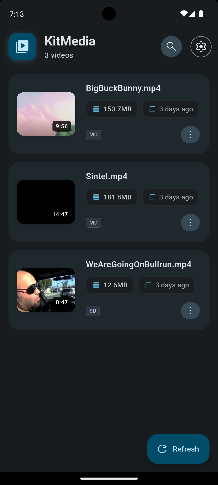
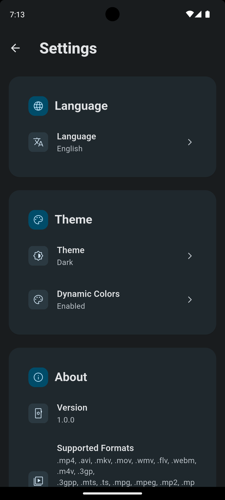

<div align="center">

# 🎬 KitMedia Player

**A modern, cross-platform video player built with Flutter**

[](https://flutter.dev)
[](https://dart.dev)
[](LICENSE)
[](https://github.com/Birmehto/kitmedia)

</div>

## 📱 Screenshots

<div align="center">
 
 


*Video Library • Custom Player • Settings Panel*
</div>

## ✨ Key Features

- **🎥 Smart Discovery** - Automatically scans and organizes device videos
- **🎨 Material 3 Design** - Beautiful dark/light themes with adaptive colors  
- **🔍 Instant Search** - Real-time video search with filters
- **🎛️ Advanced Controls** - Gesture support, playback speed, quality selection
- **📱 Responsive UI** - Optimized for phones, tablets, and foldables
- **🌍 Internationalization** - Multi-language support ready

## 🚀 Quick Start

### Prerequisites
- Flutter 3.9.2+ and Dart 3.0+
- Android Studio or VS Code with Flutter extensions

### Installation
```bash
# Clone and setup
git clone https://github.com/Birmehto/kitmedia.git
cd kitmedia
flutter pub get

# Run on device
flutter run
```

## 🛠️ Technology Stack

| Component | Technology |
|-----------|------------|
| **Framework** | Flutter 3.9.2+ |
| **Language** | Dart 3.0+ |
| **State Management** | GetX |
| **UI Design** | Material 3 |
| **Video Engine** | video_player + Chewie |

## 📋 Supported Formats

**Video:** MP4, AVI, MKV, MOV, WMV, WebM, FLV, 3GP, M4V  
**Codecs:** H.264, H.265/HEVC, VP8, VP9, AV1

## 🎯 Roadmap

- [x] Core video playback and discovery
- [ ] Playlist management and favorites
- [ ] Subtitle support (SRT, VTT)
- [ ] Chromecast integration
- [ ] Picture-in-picture mode

## 📱 Platform Support

| Platform | Status | Minimum Version |
|----------|--------|-----------------|
| Android | ✅ Stable | API 21 (5.0+) |
| iOS | ✅ Stable | iOS 12.0+ |
| Web | 🔄 In Development | - |

## 🤝 Contributing

We welcome contributions! Please see our [Contributing Guidelines](CONTRIBUTING.md) for details.

## 📄 License

This project is licensed under the MIT License - see the [LICENSE](LICENSE) file for details.

---

<div align="center">

**⭐ If you find this project helpful, please give it a star!**

Made with ❤️ by [Birmehto](https://github.com/Birmehto)

</div>